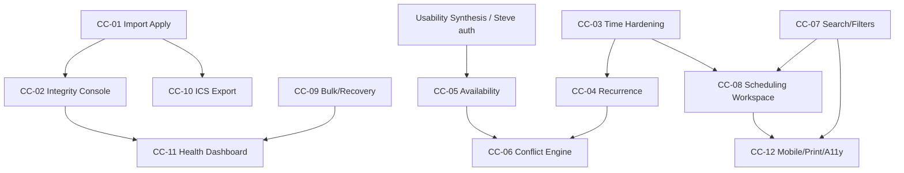

# Kelly Calendar Completion Assessment

**Author:** Burt (discovery)  
**Date:** 2026-07-21  
**Baseline:** `main` @ `9c89012` · production live · worktree clean at discovery  
**Nature:** Read-only discovery — no implementation in the discovery pass  

**Program lock:** Accepted and locked by Steve on 2026-07-21 as  
`develop_notes/KCCC_CALENDAR_COMPLETION_PROGRAM.md` (CC-01…CC-12).  
Kelly decision defaults from §Decisions needed from Kelly were adopted as ADR-081–085.

---

## Executive conclusion

Kelly Calendar is a **campaign-grade calendar foundation with a populated statewide Event graph**, not a finished calendar product.

**Rough completeness (calendar-only):** ~55–65% of what operators need to *trust and run* the calendar day-to-day. Steps 8–11 are build-complete; views + event sheet + upload exist; ~122 active Events through Election Day. The remaining gaps are concentrated in **integrity/provenance, import→canonical apply, time/recurrence correctness, conflict/availability intelligence, discovery UX, export, and ops health**—not in “add more campaign modules.”

**~12 calendar deliverables is accurate.** The frozen V2.1 **D20–D26** track is Communications (out of scope). Roadmap **Steps 12–13** are two large gates, not twelve. This program therefore uses provisional **CC-01…CC-12** (*Calendar Completion*), each mapped to the 25-step roadmap where relevant.

**Most important remaining gaps**
1. Staged Google/iCal import **cannot approve into canonical Events** (`import-approval-service.ts` is a stub).  
2. Recurrence is **weekly materialize + reschedule scopes** only—no series exceptions / full RRULE.  
3. Time integrity: overnight/cross-midnight and all-day editing are **weak**; multi-day display is start-day-biased.  
4. Conflicts are **in-memory overlap badges**, not a persisted Conflict Engine (Step 13 blocked on Step 12).  
5. Operator discovery (search/filters/saved views), ICS export, bulk recovery, mobile/print still thin.  
6. Live data pressure: many HOLDs + known triple/dual conflicts from operator testing—needs a calendar integrity surface.

**Recommended overall sequence:** Option C (balanced)—integrity + import apply first, then time/recurrence, then availability→conflict (Steps 12→13), then discovery/workspace, then export/ops/mobile.

---

## Current architecture

```text
Authoritative SoR: Prisma Event (canonical-event.ts)
  ├── EventCalendarMembership / calendars (17 seeded)
  ├── Status + EventStatusHistory (incl. CANCELLED / ARCHIVED)
  ├── Visibility / tags / people / orgs / geography
  ├── Travel plan + segments · briefing · packing · program flow
  ├── Recurrence fields: isRecurring, recurrenceSeriesId, recurrenceRule, originalOccurrenceAt
  │     (no SeriesException table; weekly expand on create, max 12)
  ├── isImported + ExternalEventIdentity (fingerprint unique per source)
  ├── CampaignMission 1:1 via sourceEventId (Event remains schedule SoR)
  ├── EventPlanningDraft (Postgres) for full planner
  └── OperationalConflictRecord (schema + ack APIs; almost no create/detect→persist)

Import path (IMPORT_ONLY):
  ExternalCalendarSource → CalendarImportRun → CalendarImportRecord
  + filesystem staging under data/ingest_staging/
  + Google OAuth readonly / public+private iCal providers
  → approveImportRecord / merge / reject = STUB (auth gate only)

Views: Today · Day · Week · Month · Agenda (all ready:true)
  + /calendar/ops/[lens] secondary lenses
Sheet: /events/[eventId] · Upload: /upload · Add: /add/quick|full|templates
TZ: America/Chicago helpers (offset candidate pick for CST/CDT)
Overlaps: detectCandidateOverlaps in-memory on operating views
Mobilize D16–D18: event publish/attendance (not Google sync); Comms D20–D26 FROZEN
```

| Piece | Classification |
|-------|----------------|
| Canonical Event + lifecycle APIs + event sheet | Complete / production-ready (under-tested edge cases) |
| Five primary views | Complete; list/grid not interactive schedulers |
| Mission projection | Complete for calendar boundary; campaign lifecycle UI separate |
| Weekly recurrence create + series reschedule | Partial |
| Series exceptions / EXDATE / edit-one-occurrence detach | Missing |
| Import preview/stage/fingerprint | Strong foundation |
| Import approve→canonical | Documented but not implemented (stub) |
| ICS export / feeds | Missing |
| AvailabilityRule engine | Documented policy only (Step 12 NOT_AUTHORIZED) |
| Conflict Engine (EA-13) | Design ready; implementation blocked |
| Saved views schema | Present; product UI missing |
| Drag/resize/bulk | Missing (deferred Pass 4) |
| Communications OS | Outside calendar scope (frozen) |

---

## What is already complete

- Auth session + RBAC scaffolding; candidate-data gate still conservative  
- Canonical Event model and mutation stack (create, edit, cancel, duplicate, archive, reschedule, publish)  
- `/events/[eventId]` full sheet; `/upload` hub; quick/full/templates entry  
- Today / Day / Week / Month / Agenda operating views (scan-first UX refresh shipped)  
- Campaign-local Chicago date keys + wall-time→UTC helpers  
- Standing availability **policy** + office-hour materialization history (listing exclusion)  
- Google/iCal **import** pipeline (preview, staging, fingerprints, IMPORT_ONLY)  
- Operator ingest scripts + major dedupe tooling (`events:dedupe:major`, analyze duplicates)  
- Event→Mission 1:1 projection authority documented and implemented  
- Statewide live calendar population through Nov 3 milestones (stress evidence)  
- Validators: `calendar:canonical:validate`, `import:*`, `conflicts:validate`, `visibility:*`  
- Netlify production path proven after earlier engine/webpack fixes  

**Read-only data snapshot (from forensic audit @ same evening; still representative at `9c89012`):**  
Events ~222 total · ~122 active · ~82 HOLD · ~37 CONFIRMED · ~99 CANCELLED · latest `KCCC-2026-0222`.  

---

## Gaps and risks

### Correctness
- Overnight / cross-midnight: day views key off **start** Chicago date; editor rejects some cross-midnight wall spans; Agenda uses UTC date slice in places  
- All-day toggle absent on event sheet  
- Recurrence ≠ full series product  

### Data integrity
- Multi-pass ingest clones historically required major dedupe  
- Provenance via `[ingestKey:…]` notes—not a first-class operator console  
- Open dual/triple HOLDs (Howard, Rector∩Nashville, Oct 10, Sep 15, etc.)  

### Operator experience
- No drag/drop, resize, bulk edit, undo  
- Search only strong on Agenda; no saved-view UI  
- Mobile / print / day book incomplete  

### Imports / sync
- **Approve/merge/reject→canonical is stubbed**  
- No Google push (intentional IMPORT_ONLY)  
- Complex RRULE unsupported on import expand  

### Interoperability
- No ICS export / subscription feeds  
- Mobilize ≠ calendar sync (keep separate)  

### Reliability / performance
- No calendar-specific health dashboard for import runs / integrity  
- Conflict DB records not produced by detectors  
- Large-range / dense-day performance not certified  

### Documentation
- `KCCC_CALENDAR_CURRENT_IMPLEMENTATION_INVENTORY.md` **stale** (Agenda, event sheet, CURRENT_STEP)  
- Usability Synthesis 1 **empty** (formal gate still OPEN)  
- Forensic Ernie doc proves gates—not calendar completion  

---

## Previous recommendations reconciled

| Prior recommendation | Status |
|----------------------|--------|
| Steps 8–11 Calendar Foundation | **Completed** |
| Operator Usability Pass 1 → Synthesis → Step 12 → Step 13 | **Still valid gate**; Synthesis empty; do not skip for intelligence builds |
| EA-8 security closeout as “next” (inventory) | **Superseded** (Step 8 complete; inventory stale) |
| Engineering Track A Pass 3–4 (availability UX, drag, filters, print) | **Still valid** as calendar UX backlog; maps into CC-05…CC-12 |
| V2 backlog (timeline, mission view, analytics) | **Defer** after calendar completion chapter |
| Comms D27 production governance | **Deferred / frozen** with D20–D26 |
| Mission D1–D19 campaign ops expansions | **Defer** except Event↔Mission boundary already done |
| “Build Step 13 now” / “Phase 13” | **Invalid** without Step 12; not a phase name |
| Stress-test Meaning A closeout | **Partial**—awaiting Steve; does not authorize AvailabilityRule alone |
| Forensic audit as numbered deliverable | **Foundation doc**, not a completed CC item—should become recurring health capability (CC-11) |

---

## Roadmap options

### Option A — Calendar correctness first
Integrity console → import apply → timezone/all-day → recurrence exceptions → availability → conflict engine → then UX.  
**Pros:** Trust before polish. **Cons:** Operators wait longer for search/print/mobile.

### Option B — Operator experience first
Search/filters → scheduling workspace → bulk → mobile/print → then import/recurrence.  
**Pros:** Daily feel improves fast. **Cons:** Imports remain half-broken; data trust lags.

### Option C — Recommended balanced sequence
Close the **import→canonical hole** and **integrity visibility** first; harden **time + recurrence**; then **Step 12→13 intelligence**; then **discovery/workspace**; finish with **export + ops health + mobile/print**.

---

## Recommended 12-deliverable calendar roadmap

**Numbering:** `CC-01`…`CC-12` (Calendar Completion).  
**Not** D27+ (comms). **Maps to** Steps 11 polish / 12 / 13 / 22 / 23 / 24 as noted.

| # | Title | Size | Maps to |
|---|-------|------|---------|
| CC-01 | Import Approval → Canonical Apply | L | Step 11/22 foundation |
| CC-02 | Calendar Integrity & Provenance Console | L | Ops correctness |
| CC-03 | Timezone, All-day, Overnight Hardening | M | Correctness |
| CC-04 | Recurrence & Occurrence Exceptions | XL | Step 11 completion |
| CC-05 | Standing Availability Inputs (calendar slice) | L | **Step 12** |
| CC-06 | Conflict Engine Calendar Slice | XL | **Step 13** |
| CC-07 | Unified Search, Filters, Saved Views | M | Experience |
| CC-08 | Advanced Day/Week Scheduling Workspace | L | Experience (grid; drag optional) |
| CC-09 | Bulk Operations, Archive/Restore, Recovery | M | Reliability |
| CC-10 | ICS Export & Subscription Privacy Controls | M | Step 22 |
| CC-11 | Calendar Health Dashboard & Forensic Automation | M | Reliability |
| CC-12 | Mobile Hardening, Print Day Sheets, A11y | M | Step 24 |

### CC-01 — Import Approval → Canonical Apply
1. **Title:** Import Approval → Canonical Apply  
2. **Problem:** Staged Google/iCal records cannot become trusted Events.  
3. **Evidence:** `src/server/services/import-approval-service.ts` stubs; inventory “import strong; export weak”; review UI “future canonical save”.  
4. **Value:** External calendars become first-class campaign schedule, not dead staging.  
5. **Scope:** Transactional approve / reject / merge → Event + memberships + `ExternalEventIdentity` + audit; idempotent re-apply.  
6. **Exclusions:** Google push/two-way; Mobilize; comms.  
7. **Surfaces:** `/import/google-calendar/review`, import APIs, event sheet provenance.  
8. **Schema:** Likely none or minor status fields; reuse ImportRun/Record.  
9. **Reuse:** Fingerprints, staging store, import-history apply patterns.  
10. **Deps:** Auth mutation gate must allow these ops (already intended).  
11. **Risks:** Duplicate Events on bad merge; PII from Google descriptions.  
12. **Validation:** `import:validate`, staging validate, golden re-import no-dupe counts.  
13. **Done:** Approve creates one Event; re-import unchanged fingerprint no-op; reject audited.  
14. **Prod migration:** Optional backfill of staged runs; no mass rewrite required.  
15. **Size:** Large  
16. **Order:** First—unblocks real sync trust without Step 12.

### CC-02 — Calendar Integrity & Provenance Console
Surfaces duplicates, near-dupes, missing ingestKey/source, CANCELLED vs active clones, open operator decision HOLDs (Oct 10, Howard×2, etc.). Wraps `events:analyze:duplicates` / dedupe in UI. **Size L.** After CC-01 so import and manual ingest share one integrity language.

### CC-03 — Timezone / All-day / Overnight Hardening
Fix sheet all-day UI; Chicago-consistent agenda keys; multi-day appearance on each spanned day; DST tests. **Size M.**

### CC-04 — Recurrence & Occurrence Exceptions
SeriesException (or equivalent), edit this / this+future / series for cancel+edit (not only reschedule), EXDATE, richer RRULE on import expand. **Size XL.** Schema likely.

### CC-05 — Standing Availability Inputs (Step 12 calendar slice)
Materialize policy into evaluable service used by create/reschedule warnings (buffers, Tuesday LR, vacation override model). **Not** full Campaign Ops Intelligence rename. **Size L.** Gate: Usability Synthesis or Steve waive for this thin slice.

### CC-06 — Conflict Engine Calendar Slice (Step 13)
Persist detections; TIME_OVERLAP + TRAVEL_INFEASIBLE minimum; editor + ops queue; `automaticallyResolved=false`. Consume CC-05. **Size XL.**

### CC-07 — Unified Search, Filters, Saved Views
Wire `CalendarSavedView`; filters by county/source/status/mission; Agenda-quality search on all views. **Size M.**

### CC-08 — Advanced Day/Week Scheduling Workspace
True time-grid density UX; optional drag later. **Size L.** No Mobilize dependency.

### CC-09 — Bulk Ops, Archive/Restore, Recovery
Multi-select cancel/archive; restore in UI; soft undo window. **Size M.**

### CC-10 — ICS Export & Subscription Privacy
EXPORT_ONLY feeds; field redaction; revoke URLs. **Size M.** Kelly decision on private locations.

### CC-11 — Calendar Health Dashboard & Forensic Automation
Import run health, failed batches, integrity checks, nightly forensic summary (extends Ernie audit into product). **Size M.**

### CC-12 — Mobile, Print Day Sheets, A11y
Responsive ops; printable day/week; keyboard/SR pass. **Size M.**

---

## Dependency map



| Deliverable | Indep? | Schema? | Prod data? | Ext credentials? | Mobilize? | Mission risk? |
|-------------|--------|---------|------------|------------------|-----------|---------------|
| CC-01 | Near-indep | Low | Staging→Event writes | Google OAuth readonly | No | Low if Event SoR preserved |
| CC-02 | After CC-01 preferred | Low | Read + optional cancel clones | No | No | Low |
| CC-03 | Indep | Low | Possible time corrections | No | No | Medium if times shift |
| CC-04 | After CC-03 | **Yes** | Series repair possible | No | No | Medium |
| CC-05 | Needs auth gate | **Yes** likely | Policy materialization | No | No | Low |
| CC-06 | Needs CC-05 | Medium | Conflict rows | Routes API optional later | No | Low |
| CC-07–09,12 | Parallel after core | Low–Med | Low | No | No | Low |
| CC-10 | After CC-01 | Low | Feed tokens | No | No | Privacy risk |
| CC-11 | After CC-02 | Low | Read | No | No | None |

---

## Recommended next build

### Implementation-ready brief — **CC-01 Import Approval → Canonical Apply**

**Mission**  
Make staged Google/iCal import records become canonical `Event` rows under operator approval, with idempotent fingerprints and full audit—closing the largest hole between “import exists” and “calendar is dependable.”

**Current evidence**  
- `approveImportRecord` / `rejectImportRecord` / `mergeImportRecord` void+auth stub  
- Strong staging, fingerprints, IMPORT_ONLY OAuth  
- Review UI anticipates future canonical save  
- Manual ingests succeeded; external sync path unfinished  

**Scope**  
Transactional approve → Event + primary membership + ExternalEventIdentity + status history + audit; reject with reason; merge onto existing Event; unchanged fingerprint skip; operator-visible run summary.

**Non-negotiable invariants**  
- Event remains SoR; no silent Mission creation unless existing project-on-confirm policy  
- `automaticallyResolved` never invents schedule changes  
- No Google write-back  
- No secret/PII in git proofs  
- Re-import must not duplicate  

**Expected models**  
Reuse `CalendarImportRun`, `CalendarImportRecord`, `ExternalEventIdentity`, `Event`; extend review action enums if needed.

**Expected routes**  
Finish `/api/import/...` approve/reject/merge; review page actions; link from event sheet to source identity.

**Expected behavior**  
Operator reviews staged row → Approve → lands on calendar in correct Chicago bounds → appears in Day/Week → re-sync no duplicate.

**Migration**  
None required for empty staging; optional script to report stranded staged records (read-only first).

**Validation**  
`import:validate`, `import:staging:validate`, unit tests for fingerprint idempotency, count assertion: approve N → +N Events (or +N−merges), second sync +0.

**Documentation**  
Update import runbook; mark inventory import-apply COMPLETE; note CC-01 in roadmap.

**Rollback**  
Feature flag disable approve mutations; leave staging intact; soft-cancel Events created under failed batch tag if needed.

**Ship criteria**  
One real IMPORT_ONLY source: preview→stage→approve→visible Event; reject path audited; merge path proven; Netlify prod green; no PII in proofs.

---

## Decisions needed from Kelly

1. **Import field precedence:** On re-import when fingerprint *changes*, do **local operator edits** win, or **source** win, or **field-level merge**?  
   - *Default:* Local wins on title/notes/status; source wins on raw start/end if Event still `isImported` and never manually rescheduled.  
   - *Alt:* Source always wins → risk overwriting campaign HOLDs.

2. **Public ICS subscriptions?** Desired for staff/volunteers?  
   - *Default:* Private signed feeds only (CC-10); no public anonymous URL.  
   - *Alt:* Public filtered calendar → requires aggressive redaction.

3. **Drag-and-drop editing in CC-08?**  
   - *Default:* Ship grid + click-to-edit first; drag in a follow-on.  
   - *Alt:* Drag in CC-08 → larger QA / accidental move risk.

4. **May calendar feeds expose private / residence locations?**  
   - *Default:* CITY or BUSY_ONLY on feeds; exact address never.  
   - *Alt:* Exact on private feeds → higher leak risk.

5. **When Google deletes a source event:** keep as **CANCELLED history** on KCCC, or **hide**, or **prompt**?  
   - *Default:* CANCELLED with provenance note (Doctrine #1 / audit).  
   - *Alt:* Auto-hide → loses campaign memory.

---

## Evidence appendix

**Files / areas inspected**  
`src/lib/system/constants.ts`, `prisma/schema.prisma` (Event, import, mission, conflicts), `event-lifecycle-service.ts`, `EventEditorForm.tsx`, `CalendarViewSwitcher.tsx`, `chicago-date.ts`, `import-approval-service.ts`, `calendar-import/*`, `google-integration/*`, `conflict-service.ts`, `/events/[eventId]`, `/upload`, operating view services.

**Notes**  
`KCCC_FORENSIC_AUDIT_ERNIE_STEP13_REENTRY_2026-07-21.md`, `KCCC_CALENDAR_25_STEP_MASTER_ROADMAP.md`, `KCCC_EA_13_*`, `KCCC_STEP_12_STRESS_TEST_CLOSEOUT_EVALUATION.md`, `KCCC_CALENDAR_CURRENT_IMPLEMENTATION_INVENTORY.md` (stale), `KCCC_V2_1_EVENTS_BECOME_MISSIONS.md`, `KCCC_ENGINEERING_TRACK_CALENDAR_EXPERIENCE.md`, `KCCC_VERSION_2_BACKLOG.md`, D16–D26 / freeze notices.

**Migrations**  
Recurrence/import/conflict models present in schema; no SeriesException migration exists.

**Validation commands**  
`calendar:canonical:validate`, `import:validate`, `import:staging:validate`, `import:preview*`, `conflicts:validate`, `visibility:validate`, `events:dedupe:major`, `events:analyze:duplicates`, numerous `events:ingest:*`.

**Production/read-only counts**  
~222 Events / ~122 active / ~82 HOLD / ~37 CONFIRMED / ~99 CANCELLED / through `KCCC-2026-0222` (forensic evening snapshot). Mission `sourceEventId` query not re-run this pass (prior model: 1:1 projection). `OperationalConflictRecord` create path absent in app code.

**Forensic findings**  
Proves Evidence Acquisition + Step 12/13 gates; does **not** prove calendar completion; should seed **CC-11**.

**TODO/FIXME**  
No literal TODO/FIXME in `src/`; deferred signals in draft banners, recurrence expand limits, program-flow drag deferral, import API stub comments, inventory PARTIAL flags.

**Assumptions / uncertainties**  
- Usability Synthesis may still be required before **CC-05/CC-06** unless Kelly/Steve explicitly authorize a calendar-completion exception.  
- Oct 17 Stuttgart/Flatrock date assumption remains operator-unconfirmed.  
- Exact Mission count not re-sampled this discovery after a failed null filter.  
- `AGENTS.md` not present at repo root (instructions live in `.cursor` / develop_notes).

---

**Discovery seal:** `main` @ `9c89012` unchanged · no writes · recommended first build **CC-01 Import Approval → Canonical Apply**.
