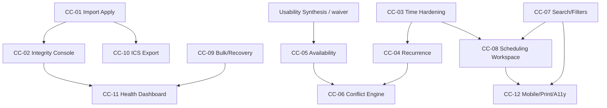

# KCCC Calendar Completion Program (CC-01…CC-12)

```text
Build ID:     KCCC-CALENDAR-COMPLETION-PROGRAM-1.0
Status:       LOCKED
Locked:       2026-07-21
Program baseline (lock): main @ 9c89012
CC-05 ship baseline:     main @ 46a72c3 · Netlify 6a60efa8f25804bc9b16f3f3
Source:       Burt discovery assessment (Option C)
Authority:    Steve acceptance of Burt defaults + sequencing adjustment
Assessment:   develop_notes/KCCC_CALENDAR_COMPLETION_ASSESSMENT_BURT_2026-07-21.md
Post-CC-05:   ADR-091 · develop_notes/KCCC_POST_CC05_USABILITY_PASS_DIRECTION.md
Phase Two:    ADR-093 · develop_notes/KCCC_PHASE_TWO_INTELLIGENT_STATEWIDE_CAMPAIGN_CALENDAR.md
```

## Governing posture

```text
Primary track ............... Calendar Completion (CC-01…CC-12) — finish intact
Standing rule ............... Every pass must improve correctness, usability,
                              interoperability, or operational reliability
                              (ADR-088). No neutral refactors / unrelated expansion.
Unrelated campaign expansion  PAUSED
Communications OS (D20–D26) . FROZEN (unchanged)
LG-1 ........................ PAUSED (unchanged)
Mobilize credentials ........ NOT required for CC-01…CC-04, CC-07…CC-12
CC-01…CC-12 ................. TECHNICALLY COMPLETE (CC-12 ADR-100)
Usability Synthesis 1 ....... EMPTY — HUMAN USABILITY GATE PENDING
Phase Two (IC-01…IC-12) ..... VISION LOCKED (ADR-093)
Protected sequence .......... Post-CC-12 human usability + AI-quality gate → IC auth
Standing execution .......... ADR-094
Next authorized action ....... Post-CC-12 Human Usability and AI-Quality Gate (not IC-01)
CC-08 ship evidence ......... tip e1ddaa7 · feature 7486aa9 · tip deploy 6a612111e81d923c5e6c58ca
CC-09 ship evidence ......... commit f8186be · deploy 6a612a7cba0c57774db91b5f
CC-09 migration ............. 20260722160000_cc09_bulk_operations (db execute + migrate resolve)
CC-09 authorization ......... develop_notes/KCCC_CC_09_AUTHORIZATION_KELLY_2026-07-22.md
CC-10 authorization ......... develop_notes/KCCC_CC_10_AUTHORIZATION_KELLY_2026-07-22.md (ADR-098)
CC-10 migration ............. 20260722180000_cc10_ics_export_subscription
CC-10 ship evidence ......... commit 0bbf751 · deploy 6a619fa32d949535124cbabc
CC-11 authorization ......... develop_notes/KCCC_CC_11_AUTHORIZATION_KELLY_2026-07-23.md (ADR-099)
CC-11 migration ............. 20260723100000_cc11_calendar_health
CC-11 ship evidence ......... commit d570dc6 · deploy 6a61aa30fc4c865f2bd3c628
CC-12 authorization ......... develop_notes/KCCC_CC_12_AUTHORIZATION_KELLY_2026-07-23.md (ADR-100)
CC-12 migration ............. none (presentation-only)
CC-12 ship evidence ......... commit 36dae8b · deploy 6a6213be8f93db1c79f4b538
CC-12 authorization ......... develop_notes/KCCC_CC_12_AUTHORIZATION_KELLY_2026-07-23.md (ADR-100)
CC-12 migration ............. NONE (print projection only)
```

This program finishes the **calendar product** (CC-01…CC-12) before Phase Two implementation. CC-10…CC-12 are **COMPLETE** under ADR-098…ADR-100 (standing ADR-094). Calendar Completion is **TECHNICALLY COMPLETE — HUMAN USABILITY GATE PENDING**. Usability Synthesis remains **EMPTY**. Phase Two IC-01…IC-12 remain vision-locked (ADR-093) until the post-CC-12 usability/AI-quality gate and separate IC authorization.

### Phase Two preview (post–CC-12)

Vision: an intelligent statewide campaign operating calendar — Mission meaning, geographic/strategic gaps, volunteers/travel coordination, mobile action — while remaining calendar-centered.

Binding AI principle: deterministic services establish facts, authorization, consent, coverage, conflicts, and permissible actions; AI understands and explains within confirmation boundaries.

Full program: `develop_notes/KCCC_PHASE_TWO_INTELLIGENT_STATEWIDE_CAMPAIGN_CALENDAR.md` (IC-01…IC-12).

## Locked sequence (Option C)

| # | Deliverable | Size | Gate / notes |
|---|-------------|------|--------------|
| **CC-01** | Import Approval → Canonical Apply | L | **COMPLETE** |
| **CC-02** | Calendar Integrity & Provenance Console | L | **COMPLETE** — detector + console; no auto Event mutation |
| **CC-03** | Timezone, All-day & Overnight Hardening | M | **COMPLETE** — doctrine + temporal service; no schema migration |
| **CC-04** | Recurrence & Occurrence Exceptions | XL | **COMPLETE** — Model B series + materialized Events; `rrule` |
| **CC-05** | Standing Availability Inputs | L | **COMPLETE** — ship baseline `46a72c3` / `6a60efa8f25804bc9b16f3f3`; Synthesis remains EMPTY |
| **CC-06** | Conflict Engine | XL | **COMPLETE** — Kelly ADR-092 (2026-07-22); calendar slice validated; Synthesis remains EMPTY |
| **CC-07** | Unified Search, Filters & Saved Views | M | **COMPLETE** — ADR-095; ship `a630c8c` / deploy `6a61167b80d9714ef4541631`; query-schema v1 |
| **CC-08** | Advanced Day/Week Scheduling Workspace | L | **COMPLETE** — ADR-096; tip `e1ddaa7` / `6a612111e81d923c5e6c58ca`; no drag/resize; no schema migration |
| **CC-09** | Bulk Operations, Archive/Restore & Recovery | M | **COMPLETE** — ADR-097; no hard delete; migration `20260722160000_cc09_bulk_operations` |
| **CC-10** | ICS Export & Subscription Privacy | M | **COMPLETE** — ADR-098; migration `20260722180000_cc10_ics_export_subscription` |
| **CC-11** | Calendar Health Dashboard & Forensic Automation | M | **COMPLETE** - ADR-099; migration `20260723100000_cc11_calendar_health`; observe/explain only |
| **CC-12** | Mobile, Print Day Sheets & Accessibility | M | **COMPLETE** (ADR-100) — no migration; technical closeout; human usability gate PENDING |

## Sequencing adjustment (binding)

1. **Build CC-01 first.**  
2. Design CC-01 provenance and audit contracts so **CC-02 can reuse them**.  
3. **Do not combine** CC-01 and CC-02 into one deliverable. The import apply path must stay small enough to validate rigorously.

```text
CC-01 = approve / merge / reject → exactly one canonical Event path
CC-02 = integrity + provenance console over the whole Event graph
Shared = provenance records, audit action vocabulary, fingerprint language
```

## Adopted defaults (ADR-081–085)

| Decision | Locked default |
|----------|----------------|
| Import field precedence | Local edits win for **title, notes, status**; source timing wins **only** when an imported Event has **never** been manually rescheduled |
| ICS feeds | **Private and signed** — no public anonymous subscription URL |
| CC-08 interaction | Ship **time grid** before drag-and-drop |
| Feed locations | Redact exact **private/residential** locations (CITY or BUSY_ONLY) |
| Source-deleted Events | Remain as **`CANCELLED` history** with provenance |

## Decisive success test — CC-01

> Approve one staged import and create exactly one canonical Event; repeat the same import and create zero additional Events; merge and reject paths remain explicit and audited; no Mission or external calendar mutation occurs.

Full build brief: `develop_notes/KCCC_CC_01_IMPORT_APPROVAL_CANONICAL_APPLY.md`

## Dependency map



## Out of scope until Calendar Completion exits

- Communications production enablement / D27+  
- Broad campaign ops expansion beyond Event↔Mission boundary already shipped  
- Google write-back / two-way sync  
- Treating Mobilize as a calendar sync dependency  
- Combining CC-01 with integrity console or Mission lifecycle work  

## Relationship to 25-step roadmap

CC items map onto Steps 11 polish / 12 / 13 / 22 / 23 / 24 without renumbering the frozen 25-step tracker. Runtime `CURRENT_STEP` for operator usability remains distinct from the Calendar Completion build pointer (`next_engineering_deliverable` / `calendar_completion_next`).

## Architecture 1.0 conformance

One canonical `Event`. Import apply writes Events only through the owned mutation stack. Missions are projections. External sources remain IMPORT_ONLY until a later, separately authorized sync program. Intelligence (CC-05/CC-06) never auto-mutates schedule without explicit approval.
