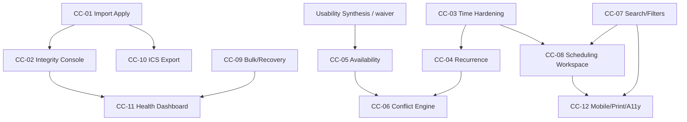

# KCCC Calendar Completion Program (CC-01…CC-12)

```text
Build ID:     KCCC-CALENDAR-COMPLETION-PROGRAM-1.0
Status:       LOCKED
Locked:       2026-07-21
Baseline:     main @ 9c89012
Source:       Burt discovery assessment (Option C)
Authority:    Steve acceptance of Burt defaults + sequencing adjustment
Assessment:   develop_notes/KCCC_CALENDAR_COMPLETION_ASSESSMENT_BURT_2026-07-21.md
```

## Governing posture

```text
Primary track ............... Calendar Completion (CC-01…CC-12)
Standing rule ............... Every pass must improve correctness, usability,
                              interoperability, or operational reliability
                              (ADR-088). No neutral refactors / unrelated expansion.
Unrelated campaign expansion  PAUSED
Communications OS (D20–D26) . FROZEN (unchanged)
LG-1 ........................ PAUSED (unchanged)
Mobilize credentials ........ NOT required for CC-01…CC-04, CC-07…CC-12
CC-05 ........................ COMPLETE (Kelly waiver ADR-090; Synthesis remains EMPTY)
CC-06 ........................ GATED (separate authorization required; not covered by ADR-090)
Usability Synthesis 1 ....... Remains EMPTY (not completed by CC-05 waiver)
Next authorized build ....... None — CC-06 Conflict Engine remains GATED
CC-01 status ................ COMPLETE
CC-02 status ................ COMPLETE
CC-03 status ................ COMPLETE
CC-04 status ................ COMPLETE
CC-05 status ................ COMPLETE
CC-05 waiver ................ develop_notes/KCCC_CC_05_WAIVER_KELLY_2026-07-22.md
```

This program finishes the **calendar product** before shifting attention to broader campaign functions. It does **not** reopen Architecture 1.0 ownership, does **not** authorize Communications production, and does **not** treat the CC-05 waiver as Usability Synthesis completion or as CC-06 authorization.

## Locked sequence (Option C)

| # | Deliverable | Size | Gate / notes |
|---|-------------|------|--------------|
| **CC-01** | Import Approval → Canonical Apply | L | **COMPLETE** |
| **CC-02** | Calendar Integrity & Provenance Console | L | **COMPLETE** — detector + console; no auto Event mutation |
| **CC-03** | Timezone, All-day & Overnight Hardening | M | **COMPLETE** — doctrine + temporal service; no schema migration |
| **CC-04** | Recurrence & Occurrence Exceptions | XL | **COMPLETE** — Model B series + materialized Events; `rrule` |
| **CC-05** | Standing Availability Inputs | L | **COMPLETE** — Kelly waiver ADR-090 (2026-07-22); Synthesis remains EMPTY |
| **CC-06** | Conflict Engine | XL | **GATED** — requires separate authorization after CC-05; **not** covered by ADR-090 |
| **CC-07** | Unified Search, Filters & Saved Views | M | Parallel after core |
| **CC-08** | Advanced Day/Week Scheduling Workspace | L | Time grid first; drag-and-drop deferred |
| **CC-09** | Bulk Operations, Archive/Restore & Recovery | M | Parallel after core |
| **CC-10** | ICS Export & Subscription Privacy | M | After CC-01; private signed feeds |
| **CC-11** | Calendar Health Dashboard & Forensic Automation | M | Prefer after CC-02 |
| **CC-12** | Mobile, Print Day Sheets & Accessibility | M | Prefer after CC-07/CC-08 |

## Sequencing adjustment (binding)

1. **Build CC-01 first.**  
2. Design CC-01 provenance and audit contracts so **CC-02 can reuse them**.  
3. **Do not combine** CC-01 and CC-02 into one deliverable. The import apply path must stay small enough to validate rigorously.

```text
CC-01 = approve / merge / reject → exactly one canonical Event path
CC-02 = integrity + provenance console over the whole Event graph
Shared = provenance records, audit action vocabulary, fingerprint language
```

## Adopted defaults (ADR-081–085)

| Decision | Locked default |
|----------|----------------|
| Import field precedence | Local edits win for **title, notes, status**; source timing wins **only** when an imported Event has **never** been manually rescheduled |
| ICS feeds | **Private and signed** — no public anonymous subscription URL |
| CC-08 interaction | Ship **time grid** before drag-and-drop |
| Feed locations | Redact exact **private/residential** locations (CITY or BUSY_ONLY) |
| Source-deleted Events | Remain as **`CANCELLED` history** with provenance |

## Decisive success test — CC-01

> Approve one staged import and create exactly one canonical Event; repeat the same import and create zero additional Events; merge and reject paths remain explicit and audited; no Mission or external calendar mutation occurs.

Full build brief: `develop_notes/KCCC_CC_01_IMPORT_APPROVAL_CANONICAL_APPLY.md`

## Dependency map



## Out of scope until Calendar Completion exits

- Communications production enablement / D27+  
- Broad campaign ops expansion beyond Event↔Mission boundary already shipped  
- Google write-back / two-way sync  
- Treating Mobilize as a calendar sync dependency  
- Combining CC-01 with integrity console or Mission lifecycle work  

## Relationship to 25-step roadmap

CC items map onto Steps 11 polish / 12 / 13 / 22 / 23 / 24 without renumbering the frozen 25-step tracker. Runtime `CURRENT_STEP` for operator usability remains distinct from the Calendar Completion build pointer (`next_engineering_deliverable` / `calendar_completion_next`).

## Architecture 1.0 conformance

One canonical `Event`. Import apply writes Events only through the owned mutation stack. Missions are projections. External sources remain IMPORT_ONLY until a later, separately authorized sync program. Intelligence (CC-05/CC-06) never auto-mutates schedule without explicit approval.
