# KCCC EA-9 — Canonical Calendar Data Model

```text
Build: KCCC-EA-9-CANONICAL-CALENDAR-DATA-MODEL-1.0
Date: 2026-07-21
Status: COMPLETE (architecture lock + code guards)
Prerequisite: Step 8 closeout accepted
Schema table of record: kelly_calendar.Event (Prisma model Event)
Code lock: src/lib/calendar/canonical-event.ts
```

---

## Governing principles (locked)

### 1 — Exactly one Event

Never create competing top-level entities:

```text
CalendarEvent · CampaignEvent · MissionEvent · ScheduleEvent · MeetingEvent
```

The canonical model is simply:

```text
Event
```

Enforced by: this document · `FORBIDDEN_COMPETING_EVENT_MODEL_NAMES` · `npm run calendar:canonical:validate`

### 2 — Everything hangs off Event

```text
Event
│
├── Time
├── Location
├── Visibility
├── Participants          → Person / Organization (references)
├── Staff Assignments
├── Purpose / Objectives
├── Preparation
├── Execution (agenda / tasks)
├── Mission               → CampaignMission (projection; NOT an Event)
├── Travel
├── Briefing
├── Notes
├── Tasks
├── Follow-up
├── Attachments
├── AI Context            (proposal_only; Step 16)
├── Audit
├── External Calendar References
└── Reserved: Communications · Expenses · Media · Security · Volunteers · Fundraising · Voter outreach
```

Mission is **not** an Event. Travel is **not** an Event. Briefing is **not** an Event.

### 3 — Event must answer operational questions

| Question | Fields / modules |
|----------|------------------|
| What is this? | `eventNumber`, titles, `eventType`, tags |
| When? | `startsAt` / `endsAt` / `timezone` / buffers / recurrence |
| Where? | venue + address + county + `virtualMeetingUrl` + Place/Geography |
| Who? | `EventPerson` / `EventOrganization` / `EventStaffAssignment` |
| Why? | `EventObjective` / descriptions / outcomes |
| Before? | packing, program flow, briefing, action items (BEFORE) |
| During? | program flow, action items (DURING), mission execution pack |
| After? | `EventFollowup`, outcomes, mission debrief/follow-up |

### 4 — Grow, don’t multiply

Attach optional modules. Do not invent parallel schedule entities.

### 5 — Relationships are references

Point to `Person`, `Organization`, `ArkansasCounty`, `Place`, `User`, `Team`. Never duplicate emails/names onto Event rows beyond display titles.

### 6 — Future-proof reserved slots

Empty modules are OK. Do not implement Communications OS, AI activation, or Google sync in this step.

---

## 1. Canonical Event model

Prisma model `Event` in `prisma/schema.prisma` (schema `kelly_calendar`) is the **atomic unit of the Campaign Operating System**.

Core identity fields:

```text
id · eventNumber · sourceType · createdByUserId · ownerUserId · primaryCalendarId
internalTitle · campaignDisplayTitle · restrictedDisplayTitle · publicTitle
eventType · eventSubtype · status · priority
startsAt · endsAt · timezone · isAllDay · isMultiDay
arrivalAt · departureAt · setupStartsAt · breakdownEndsAt
defaultVisibility · locationDisclosure · sensitivityLevel
venue / address / city / countyId / virtualMeetingUrl …
publicDescription · campaignDescription · privateNotes
candidateAttendance · candidateRole
isRecurring · recurrenceSeriesId · recurrenceRule · originalOccurrenceAt
version · archivedAt · archiveReason
```

Code alias: treat TypeScript/domain language “calendar event” as this model — never a second table.

---

## 2. Capability module diagram

```mermaid
flowchart TB
  E[Event — canonical]
  E --> T[Time]
  E --> L[Location / Place / Geography]
  E --> V[Visibility / Section ACL]
  E --> P[Participants → Person / Org]
  E --> S[Staff Assignments]
  E --> O[Objectives / Outcomes]
  E --> Prep[Preparation: packing + ROS]
  E --> Exec[Execution: actions + ROS]
  E --> M[CampaignMission projection]
  E --> Tr[TravelPlan + Segments]
  E --> B[Briefing]
  E --> N[Notes]
  E --> Tk[Tasks / ActionItems]
  E --> F[Follow-up]
  E --> A[Files + Links]
  E --> AI[AI suggestions — Step 16]
  E --> Au[StatusHistory + AuditLog]
  E --> X[ExternalEventIdentity]
  E --> R[Reserved: Comms / Expenses / Media / …]

  M --> MP[MissionPreparation]
  M --> ME[MissionExecution]
  M --> MD[MissionDebrief]
  M --> MF[MissionFollowUp]
  M --> MT[MissionTravelPlan]
```



---

## 3. Repository / service boundaries

| Layer | Responsibility | Paths |
|-------|----------------|-------|
| **Mutation repository** | Create/update/archive/restore Event rows | `event-mutation-repository.ts` |
| **Read repository** | Load Event + primary calendar | `event-repository.ts` |
| **Operations repository** | Child modules (objectives, packing, travel, staffing, …) | `event-operations-repository.ts` |
| **Event service** | Authorize + audit + call repos | `event-service.ts` |
| **Visibility service** | Safe projection for viewer | `event-visibility-service.ts` |
| **Mission projection** | Event → CampaignMission (additive pack) | `mission-projection-service.ts` |
| **Conflict service** | Feasibility warnings (Step 13 deepens) | `conflict-service.ts` |
| **Canonical lock** | Principles + lifecycle + modules | `src/lib/calendar/canonical-event.ts` |

**Write authority for schedule truth:** Event mutation path only.  
**Mission packs** must not invent alternate `startsAt`/`endsAt` sources of truth — they project from Event.

---

## 4. Authorization boundaries

| Gate | Behavior |
|------|----------|
| Middleware | Unauthenticated HTML → login; APIs → 401 |
| `canAccessEvent` | Max of primary + related calendar memberships; leadership full access |
| Section ACL | `EventSectionPermission` / membership section booleans |
| Visibility | `defaultVisibility` + overrides; public only sees public-safe projection |
| Candidate-data | Step 8 certified — authorized roles may persist real schedule data |
| Mutations | `requireAuthorized` + attributed `AuditLog` |

Unauthorized: fail closed (401/403). Never return private fields to limited viewers.

---

## 5. Migration strategy

```text
Additive only. Never destructive.
No rename of Event → CalendarEvent.
No drop of Event child tables in this step.
```

**Step 9 ship:** no new Prisma migration required — the Event graph already exists.  
**Guards:** schema comment + `calendar:canonical:validate` prevent competing models.

**Future additive migrations (later steps, not this build):**

| Step | Additive only |
|------|----------------|
| 12 | `AvailabilityRule` / `AvailabilityOverride` (or materialization) |
| 11+ | Recurrence instance override table if needed |
| Future | Reserved module tables (expenses, media, …) with `eventId` FK |

**Rollback of Step 9:** revert docs/code guards only — schema unchanged.

---

## 6. API contracts (Event-centric)

Base: `/api/events`

| Method | Path | Purpose |
|--------|------|---------|
| GET/POST | `/api/events` | List / create canonical Event |
| GET/PATCH | `/api/events/[eventId]` | Read / update |
| POST | `…/archive` · `…/restore` | Soft archive lifecycle |
| * | `…/objectives` · `…/program-flow` · `…/packing` · `…/actions` · `…/staffing` · `…/travel` | Capability modules |
| * | `…/plan` · `…/timeline` · `…/run-of-show` · `…/completion` | Operator plan surfaces |
| * | `…/mission` · `…/mission-day` | Mission projection (not a second Event) |
| * | `…/communications` | Event panel stub — OS frozen |
| * | `…/conflicts` · `…/readiness` · `…/recommendations` | Feasibility / readiness |

**Contract rule:** request/response resources are `Event` + named modules. Never introduce `/api/calendar-events` as a second resource type.

### Gaps (documented, not implemented in Step 9)

Thin or missing dedicated routes for: notes, files/links, briefing CRUD, participants CRUD, event-scoped audit browser. Implement in Steps 10–15/18–19 without new Event entities.

---

## 7. Validation rules

| Rule | Enforcement |
|------|-------------|
| `endsAt` ≥ `startsAt` | Service / zod on create-update |
| `primaryCalendarId` required | Create schema |
| Titles non-empty (internal) | Create schema |
| Auth required for mutations | API wrappers |
| Calendar create/edit membership | `requireAuthorized` |
| No competing Prisma Event models | `npm run calendar:canonical:validate` |
| Visibility never leaks private notes to limited viewers | visibility service |
| Secrets never in Event JSON | secret scan / bundle scan |

---

## 8. Event lifecycle

### Operator lifecycle (product)

```text
Draft → Scheduled → Preparing → Ready → In Progress → Completed → Follow-up → Archived
```

### Persistence (`Event.status`)

```text
DRAFT · REQUESTED · TENTATIVE · HOLD · UNDER_REVIEW · APPROVED · CONFIRMED
IN_PROGRESS · COMPLETED · CANCELLED · DECLINED · POSTPONED · ARCHIVED
```

### Derivation

`deriveEventOperationalLifecycle()` in `canonical-event.ts` maps persistence status + readiness/follow-up signals → operator lifecycle.  
**Do not** add a second status column that competes with `Event.status`.

`EventStatusHistory` records every persistence transition.

---

## 9. Extension points (implemented later)

| Module | Step | Attach how |
|--------|------|------------|
| Missions depth | 14 | Existing `CampaignMission` + packs |
| Relationships | 15 | Deepen `EventPerson` / org APIs |
| AI | 16 | `AiSuggestionRun` — proposal_only |
| Travel UX | 17 | `EventTravelPlan` façade |
| Briefing | 18 | `EventBriefing` + mission prep |
| Debrief / follow-up | 19 | `EventFollowup` + mission packs |
| Tasks / delegation | 20 | `EventActionItem` |
| Volunteers | 21 | Reserved module |
| Import/export | 22 | `ExternalEventIdentity` |
| Google sync | 23 | Import-first; Event remains master |
| Communications panel | later | `EventCommunicationsItem`; OS stays frozen |

---

## 10. ER diagram (canonical Event neighborhood)

```mermaid
erDiagram
  Calendar ||--o{ Event : primary
  Calendar ||--o{ EventCalendarMembership : layers
  Event ||--o{ EventCalendarMembership : memberships
  Event ||--o{ EventVisibilityOverride : overrides
  Event ||--o{ EventSectionPermission : sections
  Event ||--o{ EventStatusHistory : history
  Event ||--o{ EventObjective : objectives
  Event ||--o{ EventProgramFlowItem : run_of_show
  Event ||--o{ EventPackingItem : packing
  Event ||--o{ EventActionItem : tasks
  Event ||--o{ EventStaffAssignment : staff
  Event ||--o{ EventCommunicationsItem : comms_panel
  Event ||--o{ EventTravelPlan : travel
  EventTravelPlan ||--o{ EventTravelSegment : segments
  Event ||--o{ EventBriefing : briefing
  Event ||--o{ EventNote : notes
  Event ||--o{ EventFile : files
  Event ||--o{ EventLink : links
  Event ||--o{ EventFollowup : followups
  Event ||--o{ EventOutcome : outcomes
  Event ||--o{ EventPerson : participants
  Person ||--o{ EventPerson : ref
  Event ||--o{ EventOrganization : orgs
  Organization ||--o{ EventOrganization : ref
  Event ||--o| CampaignMission : projects
  Event ||--o{ ExternalEventIdentity : external_refs
  Event ||--o{ AiSuggestionRun : ai
  Event ||--o{ DataAccessLog : access
```



Full schema also includes Mission* packs, import pipeline, federated calendars, and auth models — all subordinate to or referencing Event, never replacing it.

---

## Acceptance checklist

```text
[x] Single canonical Event model documented and code-locked
[x] Module diagram delivered
[x] Repository/service boundaries documented
[x] Authorization boundaries documented
[x] Additive-only migration strategy (no destructive change this step)
[x] API contracts listed
[x] Validation rules listed
[x] Lifecycle defined (operator + persistence + derivation)
[x] Extension points reserved without implementing Phase 2/3 features
[x] ER diagram delivered
[x] No CalendarEvent / MissionEvent / etc. introduced
[x] Communications OS remains frozen
```

## Next authorized build

```text
KCCC-EA-10-CALENDAR-OPERATING-VIEWS-1.0
```

(Step 10 — Today / Day / Week / Month / Agenda — do not start automatically.)
